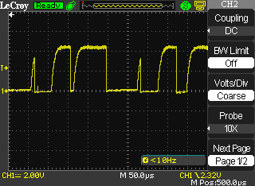

# UART OneWire Example

This example demonstrates how to utilize UART interfaces of ESP32 to use as OneWire bus. 

It uses a few DS18B20 sensors to scan a bus and write SEARCH/CALC command.

The advantage of the library is its tremendous speed and full hardware implementation.

This implementation allows the execution of other threads in parallel with the main thread while maintaining operability.

The accuracy of operations is determined by the UART subsystem.

## Hardware Required

The example can be run on any ESP32 development board connected to a PC with a single USB cable for flashing and
monitoring. The external interface should have 3.3V outputs. You may use e.g. 3.3V compatible USB-to-Serial dongle if your board doesn't containt it.

The DS18BB20 sensor works from 5V. In this case you MUST use 3V3 to/from 5V logic level converter. 
For an example like that:

```

          ^  3v3                            ^ 5v
          |                                 |
          |  4.7K                   4.7K    |
          ---/\/\/--*---          --/\/\/\---
                    |  |   G      |
                    |  |_______   |
                    |   _  _  _   |
                    |   |  ^  |   |
        TX ----|<---*---|--|--|---*------ 1-wire bus
           Schottky | S |     | D
             Diode  |   --->|--
        RX ---------|   N-Channel
                         Mosfet (BSS138 like)  
```
     

Please take note, that Schottky diode is necessary!

In a few cases you can try to use DS18B20 on 3.3v power supply without any mosfet, but anyway you MUST use Schottky diode.

## Setup the Hardware

### Prepare schema 3v3 and 5v negotiations

Connect the external serial interface to the ESP32 board as follows.

| ESP32 Interface | #define | ESP32 Pin |
| --- | --- | --- |
| Transmit Data (TxD) | OW_UART_TXD | GPIO16 |
| Receive Data (RxD)  | OW_UART_RXD | GPIO17 |
| Ground  | GND | GND |
| 3v3     | VCC | VCC |

| DS18B20    | ESP32 Pin  |
| ---------  | ---------- |
| 1-wire bus | Signal Line |
| 5V         | VDD -- External 5V supply |
| Ground     | GND |


Optionally, you can set-up and use a VDD that has +3.3V

## Configure the project

```
idf.py menuconfig
```
or
```
idf.py menuconfig
```

* Set serial port under Serial Flasher Options.

## Build and Flash

Build the project and flash it to the board, then run monitor tool to view serial output:

```
idf.py -p PORT flash monitor
```
or
```
idf.py -p PORT flash monitor
```

(To exit the serial monitor, type ``Ctrl-]``.)

## Example Output

There are three sensors on the 1-wire bus:

```
I (10) 1wire: Scan OW bus...
I (80) 1wire: DS18B20[0x28] sens id: 0x80000003D568 (CRC F4) -- 25.937500 (C)
I (100) 1wire: DS18B20[0x28] sens id: 0x80000003E20A (CRC 8C) -- 26.250000 (C)
I (130) 1wire: DS18B20[0x28] sens id: 0x041663B9BCFF (CRC 42) -- 45.875000 (C)
I (130) 1wire: Presence correct. SCAN found 3 devices on the bus
I (3130) 1wire: PRESENCE detected on 1-wire bus. Presence signal: 1
I (3130) 1wire: Scan OW bus...
I (3200) 1wire: DS18B20[0x28] sens id: 0x80000003D568 (CRC F4) -- 25.937500 (C)
I (3220) 1wire: DS18B20[0x28] sens id: 0x80000003E20A (CRC 8C) -- 26.250000 (C)
I (3240) 1wire: DS18B20[0x28] sens id: 0x041663B9BCFF (CRC 42) -- 45.875000 (C)
I (3240) 1wire: Presence correct. SCAN found 3 devices on the bus
I (6240) 1wire: PRESENCE detected on 1-wire bus. Presence signal: 1
I (6240) 1wire: Scan OW bus...
I (6310) 1wire: DS18B20[0x28] sens id: 0x80000003D568 (CRC F4) -- 25.937500 (C)
I (6330) 1wire: DS18B20[0x28] sens id: 0x80000003E20A (CRC 8C) -- 26.250000 (C)
I (6350) 1wire: DS18B20[0x28] sens id: 0x041663B9BCFF (CRC 42) -- 45.875000 (C)
I (6350) 1wire: Presence correct. SCAN found 3 devices on the bus
I (9350) 1wire: PRESENCE detected on 1-wire bus. Presence signal: 1
I (9350) 1wire: Scan OW bus...
I (9420) 1wire: DS18B20[0x28] sens id: 0x80000003D568 (CRC F4) -- 25.937500 (C)
I (9440) 1wire: DS18B20[0x28] sens id: 0x80000003E20A (CRC 8C) -- 26.250000 (C)
I (9460) 1wire: DS18B20[0x28] sens id: 0x041663B9BCFF (CRC 42) -- 45.875000 (C)
I (9460) 1wire: Presence correct. SCAN found 3 devices on the bus

```

Logic Analizer:


## Oscilloscope screenshots




Thanks to [@andrei15](https://github.com/andrei15), who was actively involved in the development of this project.

#todo Separate library and example codes into separate projects.

Thank you!

I'm looking for an interesting jobs in field of uC. If you have one write on stanislav.lakhtin@eduterra.pro
